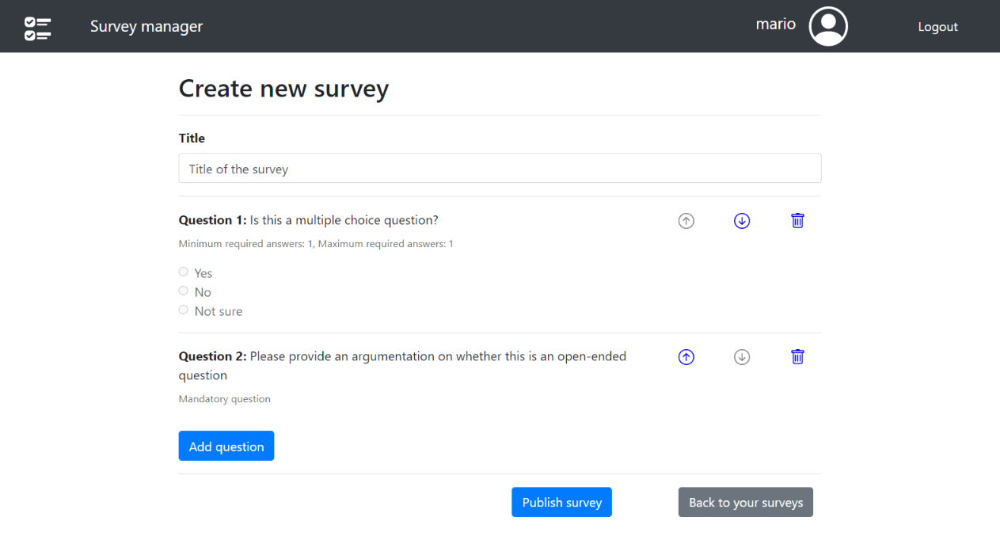

# Exam #1: "Survey"
## Student: s287965 CAVALLO ANDREA 

## React Client Application Routes

- Route `/login`: contains the login form 

- Route `/`: main page, contains the list of available surveys to fill. Surveys can be selected in order to fill them. 

- Route `/fill-survey`: contains the form that allows to fill the selected survey. The first question asks to insert a username, and then all survey's questions are listed with possible answers. 

- Route `/admin-home`: contains the list of surveys created by the logged admin with the corresponding number of responses, and a button to start the creation of a new survey.

- Route `/create-survey`: contains the form that allows to create a new survey. The inserted questions and corresponding possible answers are displayed. There is a button to add a question (which is done by means of a Modal form) and questions can be deleted and their order can be changed using specific arrows. 

- Route `/view-survey`: contains the response of a user to a survey. All the questions of the survey are shown with the corresponding answers provided by the user. 

  

## API Server

- GET `/api/surveys`
  - request parameters: none
  - response body content: list of all surveys 
  
  ```
  [{
      "id": 1,
      "title": "Holiday habits",
      "admin_id": 1
  }, {
      "id": 2,
      "title": "Stress management in university",
      "admin_id": 1
  }, {
      "id": 3,
      "title": "Popularity of reading ",
      "admin_id": 2
  }...]
  ```
  
  - error messages: `500 generic error`

- GET `/api/admin-surveys/:id`
  - request parameters: id of the logged admin (whose logged status is checked before performing the get operation)
  - response body content: list of surveys belonging to the specified admin. 
  - error messages: `400 non authorized` if the admin is not logged in, `500 generic error` if another error occurs
  
- GET `/api/survey/:id`

  - request parameters: id of the survey 

  - response body content: questions and possible answers for the selected survey

    ```
    [{
        "id": 6,
        "text": "What is your age?",
        "possible_answers": null,
        "s_id": 2,
        "min_ans": 1,
        "max_ans": 1,
        "order_id": 0
    }, {
        "id": 7,
        "text": "Please add any comment you feel appropriate",
        "possible_answers": null,
        "s_id": 2,
        "min_ans": 0,
        "max_ans": 1,
        "order_id": 4
    }, {
        "id": 8,
        "text": "What is your field of study?",
        "possible_answers": "Engineering;Literature;Physics;Mathematics;Law;Medicine;Economics;Other",
        "s_id": 2,
        "min_ans": 0,
        "max_ans": 1,
        "order_id": 1
    }...]
    ```

  - error messages: `500 generic error`

* POST `/api/survey`

  - request body content: details of the survey to add to the database

  ```
  [{
  	"title": "new survey",
  	"text": ["Question 1","Question 2","Question 3"],
  	"answers": ["a1;a2;a3", "a4;a5", ""],
  	"min_ans": [0,1,0],
  	"max_ans": [1,1,1]
  }]
  ```
  
  - response body content: none
  - error messages: `500 generic error`
  
* POST `/api/answer-survey`:

  * request body content: survey id and answers to the survey

  ```
  [{
  	"user": "Andrea",
  	"survey_id": 2,
  	"answers": ["0;1;0", "I don't know", "1;0"],
  	"question_ids": [1,0,2]
  }]
  ```

  * response body content: none
  * error messages: `500 generic error`

* GET `/api/answer-survey/:s_id/:u_id/:next`:

  * request parameters: id of the survey, id of the user whose responses we want to get, next (true if we want to get a new response, false if we want to get a response that we have already got previously)
  * response body content: answers of the requested user to the specified survey

  ```
  [{
      "id": 24,
      "username": "Maria",
      "answer": 45,
      "survey_id": 3,
      "question_id": 0,
      "user_id": 0
  }, {
      "id": 25,
      "username": "Maria",
      "answer": "",
      "survey_id": 3,
      "question_id": 4,
      "user_id": 0
  }, {
      "id": 26,
      "username": "Maria",
      "answer": "0;1;0;0",
      "survey_id": 3,
      "question_id": 2,
      "user_id": 0
  }...]
  ```

  

  * error messages:  `400 non authorized` if the admin is not logged in, `500 generic error` if another error occurs

* POST `/api/sessions`:

  * request body content: credentials of the user who is trying to login

  ```
  {
      "username": "username",
      "password": "password"
  }
  ```

  * response body content: none
  * error messages: `500 generic error` or `401 Unauthorized User`

* GET `/api/sessions/current_session`:

  * request body content: none
  * response body content: information about the authenticated user
  * error messages: `500 generic error` or `401 Unauthorized User`

* DELETE `/api/sessions/current`:

  * request body content: none
  * response body content: none
  * error messages:  `500 generic error` or `401 Unauthorized User`


## Database Tables

- Table `ADMINS` - contains data about registered admins to allow log in. The columns are:
  *  id: primary key
  * email
  * name
  * hash
- Table `SURVEYS` - contains data about the published surveys. The columns are:
  * s_id: primary key
  * title: of the survey
  * admin_id: id of the admin who created the survey
- Table `QUESTIONS` - contains data about questions of the surveys. The columns are:
  * q_id: primary key
  * question_text: the text of the question
  * possible_answers: possible answers to the question stored in a unique string separated by ";". For open questions, the field is NULL
  * survey_id: id of the survey the question belongs to
  * min_ans: number of minimum required answers for the question
  * max_ans: number of maximum required answers for the question
- Table `ANSWERS` - contains data about answers provided by users. The columns are:
  * id: primary key
  * username: name of the user providing the answers
  * answer: answer for a specific question (either the text for an open question, or a string of 0s and 1s for multiple choice questions)
  * survey_id: the id of the survey the answer belongs to
  * question_id: the id of the question the answer refers to
  * user_id: an id to uniquely identify the user providing the answer


## Main React Components

- `AddSurveyForm` (in `add_survey_form.js`): form to allow an admin to create a new survey. It shows the inserted questions and corresponding possible answers using a Form component and it allows to create a new question by means of a Modal Form. The Modal also contains a Form component inside. Specific buttons allow to change the order of the questions, to delete a question, to save the form or to go back to the main page.
- `LoginForm` (in `login_form.js`): form to allow login. It contains a Form component with specific buttons to login or go back to the main page.
- `NavBar` (in `navbar.js`): contains a Navbar component to describe the navbar of the web page. 
- `SurveyFormView` (in `survey_form_view.js`): contains a Form component to show the answers provided by a user to the selected survey. The fields of the form are in readOnly mode.
- `SurveyForm` (in `survey_form.js`): contains a Form component to show the questions for a specific survey to the user and allow him to fill the survey. Each question is managed by an additional component (`SurveyFormQuestion`) that shows the corresponding Form.Group and takes care of saving the answers of the user in the component state. 
- `SurveyList` (in `survey_list.js`): contains a ListGroup component to show a list of surveys. It is used to show all available surveys to a user and to show to an admin the surveys he created. 


## Screenshot




## Users Credentials

- username: `john.doe@polito.it`, password: `john`, created surveys:
  * Holiday habits
  * Stress management in university
  * Interest in sports
- username: `andrea@polito.it`, password: `andrea`, created surveys:
  * Popularity of reading
  * Popularity of music
- username: `mario@polito.it`, password: `mario`, created surveys:
  * Studying habits
  * Usage of Social Networks
